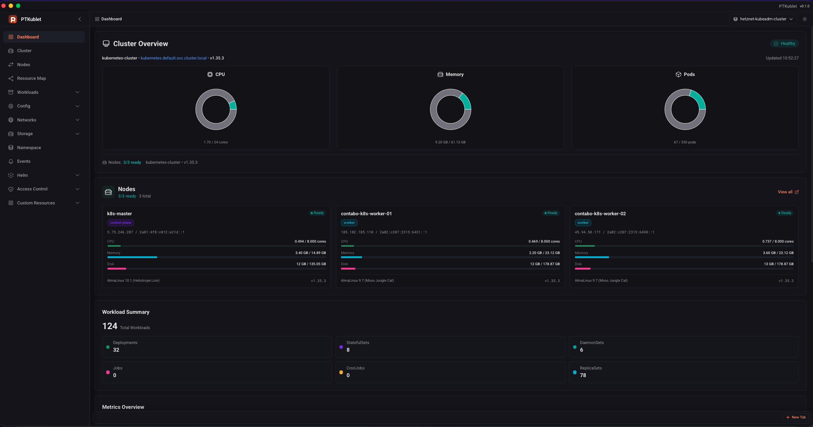
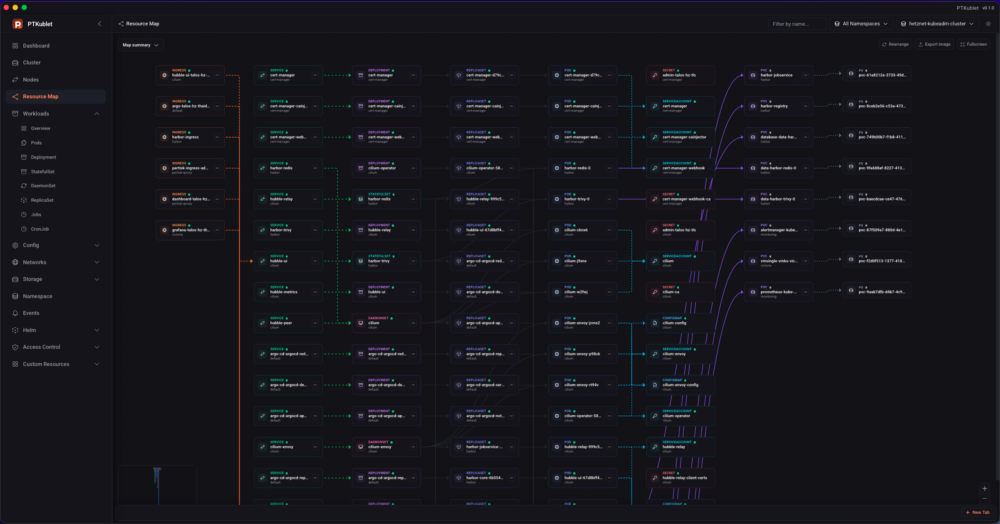
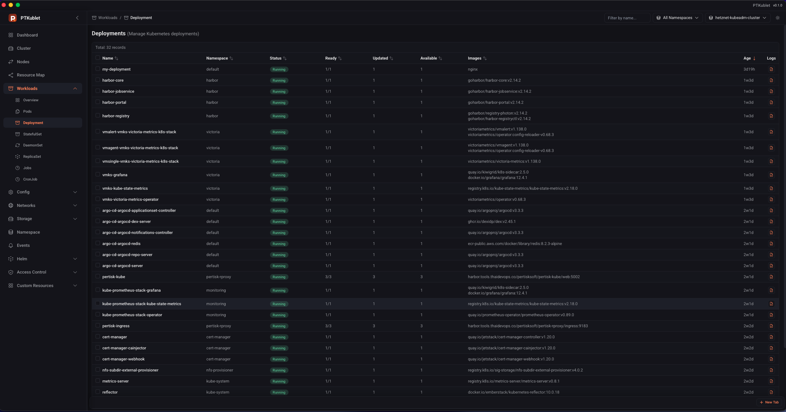

# PTKublet – Kubernetes Desktop App

A comprehensive, real-time Kubernetes management desktop application built with Tauri 2 (Rust shell), a Rust (Axum) backend sidecar, and a modern React frontend. PTKublet provides a unified native desktop interface for monitoring and managing Kubernetes clusters with a focus on performance and user experience.

This project is structured as a **single workspace**:

- `backend` – Rust service (Axum + kube-rs client) exposing a Kubernetes management API
- `frontend` – React SPA with real-time updates via WebSocket
- `frontend/src-tauri` – Tauri 2 desktop shell: spawns and manages the backend sidecar
- `proto` – gRPC protocol definitions for real-time resource streaming

## 📸 Screenshots

Add screenshots to `docs/screenshots/` and they will render in GitHub README.

### Desktop Overview





## 🎯 Core Features

### Dashboard Overview
- **Cluster Health Status** – Real-time cluster health indicators
- **Resource Utilization** – CPU, Memory, Storage, and Pod capacity monitoring (gauges and charts)
- **Node Information** – Detailed node status with allocatable resources, taints, and labels
- **Workload Summary** – Overview of Deployments, StatefulSets, DaemonSets, Jobs, CronJobs, ReplicaSets with pie charts
- **Metrics Charts** – Interactive charts (dark green primary series) for:
  - Pod status distribution (Running, Pending, Failed, Succeeded, Unknown)
  - Node status (Ready vs NotReady)
  - Pod distribution by namespace (top 10)

### Kubernetes Resources Management

#### Workloads
- **Deployments** – Full CRUD, YAML editor, real-time pod tracking, **scale replicas**, **restart** (rollout restart)
- **StatefulSets** – Manage stateful applications with YAML editor and delete
- **DaemonSets** – Monitor daemon pods with YAML editor and delete
- **Jobs** – View and manage batch jobs with YAML editor and delete
- **CronJobs** – Scheduled job management with YAML editor and delete
- **ReplicaSets** – Replica management with YAML editor and delete
- **Pods** – List with real-time CPU/memory metrics, YAML editor, **logs** (streaming), **exec terminal**, **port-forward** (create/stop from UI), delete

#### Nodes
- **Node List & Detail** – Status, capacity, allocatable, taints, labels, annotations
- **Node Actions** – Cordon, uncordon, drain, delete; YAML get/put

#### Configuration & Secrets
- **ConfigMaps** – List, YAML get/put, view data, delete
- **Secrets** – List, YAML get/put, view data, delete
- **Resource Quotas** – List, YAML get/put, delete
- **Limit Ranges** – List, YAML get/put, delete

#### Networking
- **Services** – List, YAML get/put, delete (ClusterIP, NodePort, LoadBalancer)
- **Endpoints** – List, YAML get/put, delete
- **Ingresses** – List, YAML get/put, delete
- **Ingress Classes** – List, YAML get/put, delete
- **Network Policies** – List, YAML get/put, delete
- **Port Forwarding** – List active port-forwards, create (pod/port), stop, delete (backend-managed)

#### Storage
- **Persistent Volumes (PV)** – List, YAML get/put, delete
- **Persistent Volume Claims (PVC)** – List, YAML get/put, delete
- **Storage Classes** – List, YAML get/put, delete

#### Access Control (RBAC)
- **Service Accounts** – List, YAML get/put, delete
- **Roles** – List, YAML get/put, delete
- **Role Bindings** – List, YAML get/put, delete
- **Cluster Roles** – List, YAML get/put, delete
- **Cluster Role Bindings** – List, YAML get/put, delete

#### Config & Advanced
- **Horizontal Pod Autoscaling (HPA)** – List, YAML get/put, delete
- **Pod Disruption Budgets (PDB)** – List, YAML get/put, delete
- **Priority Classes** – List, YAML get/put, delete
- **Runtime Classes** – List, YAML get/put, delete
- **Leases** – List, YAML get/put, delete
- **Mutating/Validating Webhook Configs (MWC/VWC)** – List, YAML get/put, delete

#### Backup & Restore
- **Backup Configuration** – Configure backup settings and S3 destination, test connection, and apply configuration
- **Backup Scheduling** – Create/update/delete backup schedules and run schedules manually
- **Backup Inventory** – List backups, inspect backup details, and bulk delete backup runs
- **Restore Operations** – Trigger restore from selected backups and monitor restore list/status

#### Namespaces & Events
- **Namespaces** – List, delete (with confirmation)
- **Events** – Cluster/namespace-scoped events list
- **Custom Resources (CRDs)** – List CRDs; list and manage custom resources per CRD

### Real-Time Features

#### WebSocket live updates (`/ws` – Kubernetes watch)
Resource list pages subscribe over a single WebSocket and receive watch events (add/update/delete). No polling; list updates as soon as the cluster state changes.

- **Workloads:** Deployments, StatefulSets, DaemonSets, ReplicaSets, Jobs, CronJobs, **Pods** (list from watch; CPU/memory merged from REST)
- **Cluster:** Namespaces, **Nodes**, Events
- **Config:** ConfigMaps, Secrets, ResourceQuotas, LimitRanges, HPA, PDB, PriorityClasses, RuntimeClasses, Leases, MWC, VWC
- **Network:** Services, Endpoints, Ingresses, IngressClasses, NetworkPolicies
- **Storage:** PersistentVolumes, PersistentVolumeClaims, StorageClasses
- **RBAC:** ServiceAccounts, Roles, RoleBindings, ClusterRoles, ClusterRoleBindings
- **Custom:** CRDs list (sidebar), custom resources per CRD  
- **Workload overview** page uses the same WebSocket hooks for all workload types.

**Pods:** Pod list is realtime via WebSocket; CPU/memory metrics come from the metrics API and are merged in (so metrics update when the pod list or REST metrics response updates).

#### Other realtime
- **Pod Exec** – Interactive shell (`/bin/sh`) via WebSocket **`/api/exec`** (bidirectional stream).

#### Polling (REST + refetchInterval)
- **Dashboard** – Summary and pod count from REST (no interval); **nodes** (list + metrics) polled every **30s**.
- **Nodes page** – List is WebSocket; **node metrics** (CPU/memory, `kubectl top`) polled every **30s**.
- **Port forwards** – List polled every **5s**.

#### Not realtime
- **Pod logs** – Single REST request returns log output (no WebSocket stream/follow from the UI).

### Security
- **RBAC** – Backend uses Kubernetes RBAC (service account / kubeconfig)
- **Secure YAML** – Edit and apply with validation

### User Interface
- **Dark / Light Theme** – Omni-inspired dark theme; system-aware light/dark
- **Responsive Layout** – Sidebar navigation, data tables, detail drawers
- **Data Tables** – Sortable, filterable; font size aligned with sidebar
- **Detail Panels** – Key/value layout; **Labels** and **Annotations** in title case; aligned key/value columns
- **Dashboard** – Gauges and charts (primary color dark green)
- **Confirm Dialogs** – Confirm before destructive actions (delete, uninstall, rollback)

## 📋 Build & Development

### Prerequisites
- Rust 1.70+ (for backend)
- Node.js 18+ (for frontend)
- Kubernetes cluster (1.20+)

### Build / Run (workspace root)

```bash
# build Rust backend
make build-backend
```

### Desktop (Tauri + Rust Backend Sidecar)

Tauri shell files live in `frontend/src-tauri`.

```bash
# from workspace root

# Development: run desktop app with hot-reload
make run-desktop
# or
make run

# Build macOS app bundle (`.app`)
make build-desktop

# Build macOS DMG installer (macOS only)
make build-macos-dmg
```

**Desktop Flow:**
- On startup, you're prompted to select a kubeconfig file and cluster context.
- The selection is persisted; you can switch clusters later from the top navigation bar.
- Login screen is removed; authentication is handled by kubeconfig.

**Backend Configuration is Critical:**
- The desktop app starts the Rust backend as a sidecar. If it can't be found, you'll see a red error banner on startup.
- **If you see "Backend configuration error":**
  1. Click the **Configure** button in the banner (or navigate to **Config** → **Desktop Settings**)
  2. Set the **Backend Binary Path** to the full path of your compiled backend, e.g.:
     ```
      /Users/your-username/projects/pertisk-tech/pertisk-kube-app/target/debug/pertisk-kube-backend
     ```
      For production/distribution builds, use the release binary path instead.
  3. The app will automatically restart the backend with the new path
  4. If the issue persists, click the cluster dropdown and **Retry** to reload

**Backend Binary Search Order** (automatic, no action needed if binary is in one of these locations):
1. Environment variable `PERTISK_BACKEND_BIN`
2. Default workspace paths:
  - `target/debug/pertisk-kube-backend`
  - `backend/target/debug/pertisk-kube-backend`
  - `target/release/pertisk-kube-backend`
  - `backend/target/release/pertisk-kube-backend`
3. Home directory fallback: `~/projects/pertisktech/pertisk-kube-app/backend/target/release/pertisk-kube-backend`
4. macOS app bundle resources (for distributed builds)

**DMG Builds:**
- `make build-macos-dmg` creates a bundled `PTKublet_0.1.0_aarch64.dmg` for distribution.
- The bundled app includes the backend sidecar binary and will also bundle `ktail` when available at build time.
- `make build-macos-dmg` auto-builds `../pertisk-ktail` (if that sibling repository exists) and embeds its `ktail` binary.
- You can also explicitly provide a ktail path: `KTAIL_BINARY_PATH=/absolute/path/to/ktail make build-macos-dmg`.
- If `ktail` is not bundled and not installed on the host, `ktail` terminal actions will not work until one of those is available.
- For development, `make run-desktop` auto-discovers the binary from standard workspace layout.

**Desktop sidecar config:**
- Persisted locally and editable from the UI at **Config** → **Desktop Settings**: backend binary path, kubeconfig path, cluster context, and port.
- Sidecar lifecycle hardening includes: startup `/api/health` probe, auto-restart on crash, cluster verification before switch, and rollback on failure.
- Set `PORT` before launching if you need a non-default backend port.

##  Technology Stack

### Desktop Shell
- **Tauri 2** - Native desktop framework (Rust core + WebView frontend)

### Backend
- **Rust 1.70+** - Systems programming language
- **Axum** - Ergonomic and modular web framework
- **kube-rs** - Kubernetes client library
- **Tokio** - Async runtime
- **Tonic** - gRPC framework
- **Serde** - Serialization/deserialization

### Frontend
- **React 18** - UI library
- **TypeScript** - Type-safe JavaScript
- **Vite** - Fast build tool
- **TanStack Query** - Data fetching and caching
- **Tailwind CSS** - Utility-first CSS framework
- **Recharts** - React charting library
- **Chart.js** - Data visualization
- **react-markdown** / **remark-gfm** - Markdown rendering
- **Lucide React** - Icon library

## 📝 Configuration

### Environment Variables (Backend)
- `KUBECONFIG` - Path to kubeconfig file (optional, uses in-cluster config if not set)
- `PORT` or `APP_PORT` - HTTP server port (default: `15222`)
- `GRPC_PORT` - gRPC server port (default: `50051`)
- `RUST_LOG` - Log level (default: `info`)

## 🔐 Security

- **HTTPS Ready** - Deploy behind reverse proxy for TLS
- **kubeconfig Auth** - Uses kubeconfig-based cluster authentication
- **RBAC Compliant** - Respects Kubernetes RBAC
- **Service Account** - Uses Kubernetes service accounts for in-cluster API access
- **Read-Heavy** - Mostly read-only operations (safe for monitoring)

## 💡 Usage Examples

### Scaling a Deployment

1. Navigate to **Deployments** page
2. Click on a deployment to open the detail panel
3. Scroll to "Scale Deployment" section
4. Enter the desired number of replicas (0-N)
5. Click "Scale" button
6. Deployment will scale to the specified number of pods

## 📝 License

See LICENSE file for details.
 
